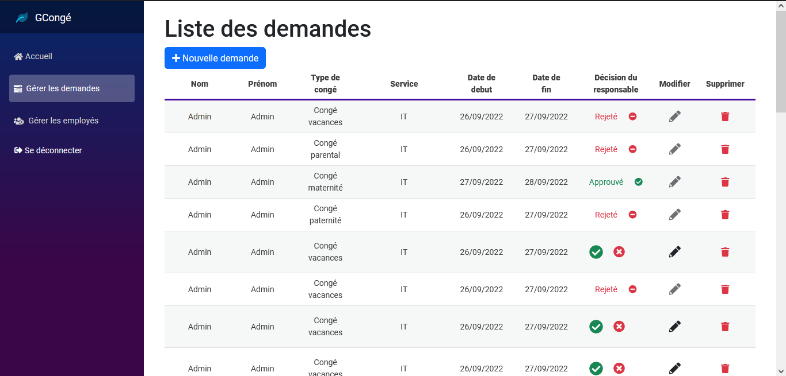
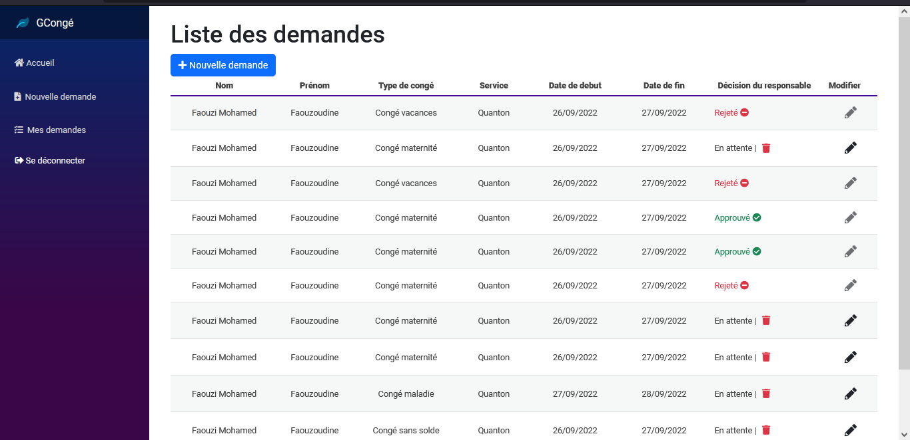

# LeaveManagement / Gestion de congé - GCongé :smile:
<h2 align="center" style="font-size:2rem">A Single page Application (SPA) representing a small platform to manage Leave request in a company!!</h2>

|Admin Dashboard|User Dashboard|
|---|---|
|||
|||
## Tech
The app is Fully written in C# (with some little mini mini small :child: amount of Javascript).  
- The frontend is written with Microsoft's **Blazor Web Assembly** using bootsrap 5 for stealing.
- The Backend is Written With Microsoft's Asp.net Core. A blazing fast Web framework!!!!!

The communication between them is backed with REST.

### Why using them ?
- Because i love DotNet Ecosystem and Microsoft is doing a greate job now with the Dotnet 6+ Platform.
- I wanted to test the legend of writtent frontend SPA without relying on JS unlike react/angular/....
- It's a plus on Clean architecture for me
-...

## Getting started
- Install DotNet Core SDK and Command Line (Just install Visual studio and web development kits required for asp dotnet core and Blazor WASM)
- Install Mysql 

- Open the solution and set the `GConge.web.api` as **Startup project**
- Run migrations command to initiate the Database
- Run the backend server => 
  ```powershel
  cd GConge.web.api
  dotnet watch
  ```
- Run the frontend server
  ```powershel
  cd GConge.Web.Client
  dotnet watch
  ```

The browser should open and will let you explore the app.
